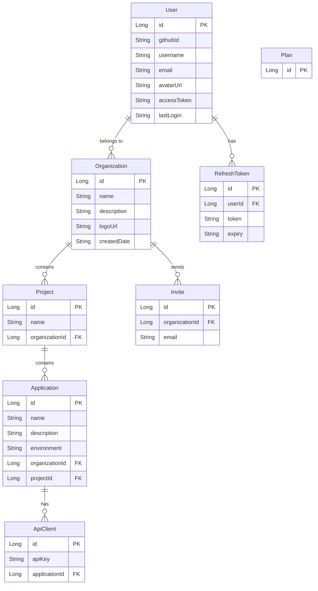

# Database Strategy

> Data storage decisions, schema ownership, and query patterns for the Upblit platform.

---

## Database Inventory

| Database | Type | Usage | Connection |
|---|---|---|---|
| PostgreSQL | Relational (JPA/Hibernate) | Identity, structure, billing | `POSTGRES_URL` env var |
| MongoDB Atlas | Document (Spring Data MongoDB) | Telemetry, AI content | `MONGODB_URI` env var |
| Supabase | Object storage | Files (logos, AI docs) | `SUPABASE_URI` + `SUPABASE_API_KEY` |

---

## PostgreSQL — Schema Ownership

Managed by Spring JPA with `ddl-auto=update`. All entities are in `com.upblit.backend.core` and `com.upblit.backend.security`.

### Entity Map

### PostgreSQL Rules
- `ddl-auto=update` is active — Hibernate auto-migrates schema on startup
- **Risk**: `update` mode can cause data loss on column type changes or renames
- **Recommendation**: Switch to `validate` in production + use Flyway for explicit migrations
- Never store binary data (files, images) in PostgreSQL — use Supabase
- Foreign key relationships are managed by JPA `@ManyToOne` / `@OneToMany` annotations

---

## MongoDB — Collection Ownership

Managed by Spring Data MongoDB. Collections are in `com.upblit.backend.query.model` and `com.upblit.backend.ai`.

### Collections

| Collection | Java Model | Purpose |
|---|---|---|
| `traces` | `Trace` | Distributed trace spans from SDKs |
| `logs` | `Log` | Structured log entries from SDKs |
| `metrics` | `Metrics` | Application metrics (SDK emitter not yet built) |
| `docs` | `Doc` | AI knowledge-base documents (metadata) |
| `tenants` | `Tenant` | AI Gateway tenants |

### MongoDB Rules
- Traces and logs are **write-heavy, read-occasionally** — optimize for write throughput
- Index `projectId` and `applicationId` on traces and logs collections for query performance
- Index `traceId` for trace correlation queries
- No TTL (time-to-live) policy is currently configured — data grows indefinitely
- **Recommendation**: Add TTL index on `timestamp` field (e.g., 90-day retention) before production scale

### Query Patterns

| Query | Endpoint | Collection |
|---|---|---|
| All traces for a project | `GET /logs/project?id={projectId}` | `traces` |
| All logs | `GET /ingest/logs` | `logs` |
| Metrics | `GET /metrics` | `metrics` |

---

## Supabase — File Storage

Used for:
- Organization logos (uploaded via `POST /org` with multipart form)
- AI Gateway documents (uploaded via `POST /ai/docs?TenantId={id}`)

Managed by `SupabaseService` in `com.upblit.backend.Library`.

### Supabase Rules
- Files are stored in Supabase buckets — not on the application server
- The backend stores the Supabase file URL in the database (e.g., `Organization.logoUrl`)
- File access should use Supabase's CDN URLs — do not proxy files through the backend
- Validate file type and size before uploading to Supabase

---

## Data Isolation (Multi-Tenancy)

The current data model uses **shared database, shared schema** multi-tenancy:
- All organizations share the same PostgreSQL tables
- All telemetry shares the same MongoDB collections
- Isolation is enforced at the application layer via `organizationId` / `projectId` / `applicationId` filters

**Risk**: A bug in authorization logic could expose one organization's data to another.

**Recommendation**: Add row-level security (RLS) in PostgreSQL as a defense-in-depth measure.

---

## Known Database Gaps

| Gap | Impact | Priority |
|---|---|---|
| No explicit database migrations (Flyway/Liquibase) | Schema changes are risky in production | High |
| No TTL on MongoDB telemetry collections | Storage grows unbounded | High |
| No indexes documented on MongoDB collections | Query performance degrades at scale | High |
| No row-level security in PostgreSQL | Authorization bugs could leak cross-org data | Medium |
| `ddl-auto=update` in production risk | Column renames/type changes can cause data loss | Medium |
| API key stored as plaintext (unverified) | DB breach exposes all API keys | High |
