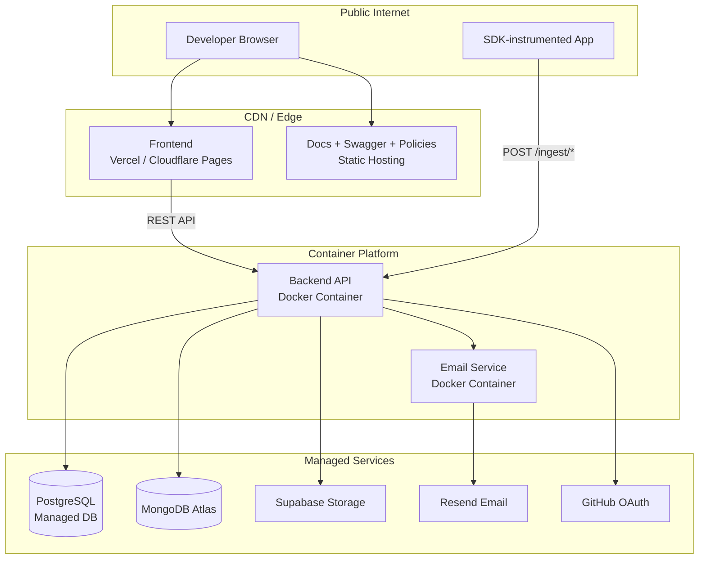

# Deployment Strategy

> Current state analysis and recommended deployment approach. This is a planning document — no deployment automation exists yet.

---

## Current State

| Component | Deployment Method | Status |
|---|---|---|
| Backend | `Dockerfile` present in `Upblit/backend/` | Containerizable, not automated |
| Frontend | Next.js — deployable to Vercel or container | No deployment config found |
| Email Service | Node.js Express — deployable as container | No Dockerfile found |
| Docs | Next.js static/SSR | No deployment config found |
| Swagger UI | Next.js | No deployment config found |
| Policies | Next.js | No deployment config found |
| DeployX CLI | Go binary | No build/release pipeline found |
| SDKs | npm / Go module / PyPI | Express SDK has `.tgz` package; others not published |

**No CI/CD pipeline exists.** No `docker-compose.yml`. No Kubernetes manifests. No `.github/workflows/`.

---

## Backend Dockerfile Analysis

The `Upblit/backend/Dockerfile` exists. Standard Spring Boot container build. Requires:
- `MONGODB_URI`
- `POSTGRES_URL`, `POSTGRES_USERNAME`, `POSTGRES_PASSWORD`
- `GITHUB_CLIENT_ID`, `GITHUB_CLIENT_SECRET`, `REDIRECT_URI`
- `FRONTEND_URI`
- `JWT_SECRET`
- `EMAIL_URI`, `EMAIL_SECRET`
- `SUPABASE_API_KEY`, `SUPABASE_URI`

All secrets must be injected at runtime via environment variables — never baked into the image.

---

## Recommended Deployment Topology



---

## Environment Variables Required

### Backend
```
MONGODB_URI=mongodb+srv://...
POSTGRES_URL=jdbc:postgresql://...
POSTGRES_USERNAME=...
POSTGRES_PASSWORD=...
GITHUB_CLIENT_ID=...
GITHUB_CLIENT_SECRET=...
REDIRECT_URI=https://<backend-domain>/login/oauth2/code/github
FRONTEND_URI=https://<frontend-domain>
JWT_SECRET=<min-256-bit-random-string>
EMAIL_URI=http://<email-service>:3000
EMAIL_SECRET=...
SUPABASE_API_KEY=...
SUPABASE_URI=https://<project>.supabase.co
```

### Frontend
```
NEXT_PUBLIC_BACKEND_URI=https://<backend-domain>
NEXT_PUBLIC_API_URL=https://<backend-domain>
NEXT_PUBLIC_ORGANIZATION_ID=  # optional default org
```

---

## Deployment Gaps (Documented, Not Fixed)

| Gap | Impact | Priority |
|---|---|---|
| No CI/CD pipeline | Manual deployments only | High |
| No `docker-compose.yml` | Cannot run full stack locally with one command | High |
| No health check endpoint in frontend | Load balancer cannot verify frontend health | Medium |
| Backend health check is in SDK middleware only (`/health`) | Backend has no dedicated health endpoint | Medium |
| No Kubernetes manifests | Cannot deploy to K8s without writing from scratch | Medium |
| Email service has no Dockerfile | Cannot containerize email service | Medium |
| No release tagging for SDKs | Go SDK and Python SDK have no published versions | Medium |
| No rollback strategy documented | No `deployx rollback` implementation in CLI | Low |

---

## SDK Distribution

| SDK | Current State | Distribution Target |
|---|---|---|
| Express SDK | Published as `.tgz` (v2.0.0) | npm registry |
| Go SDK | Source only | `go get github.com/upblit/go-sdk` |
| Python SDK | Source only, `pyproject.toml` present | PyPI |
| Java SDK | Empty stub | Maven Central |
| React SDK | Empty stub | npm registry |

---

## Deployment Principles

1. **Immutable containers** — build once, deploy anywhere. No SSH into running containers.
2. **Secrets via environment** — never bake secrets into images or source code.
3. **Health checks required** — every service must expose a `/health` endpoint before being added to a load balancer.
4. **Zero-downtime deploys** — use rolling updates or blue/green when deploying the backend.
5. **Database migrations are explicit** — `ddl-auto=update` is acceptable for development; production should use explicit migration scripts (Flyway/Liquibase) before the backend scales.
