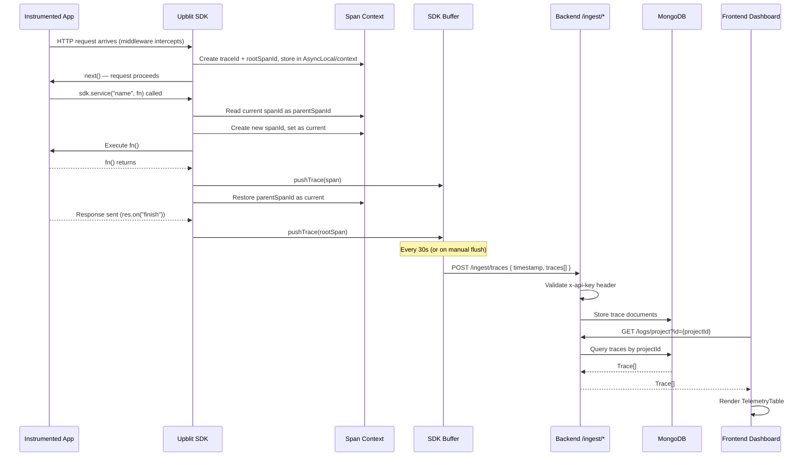
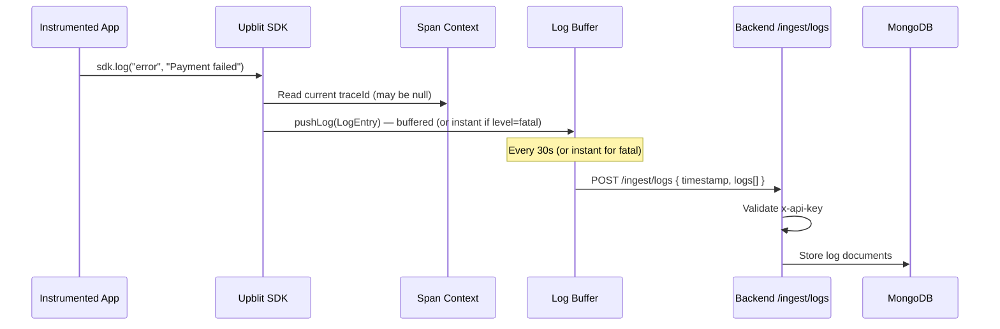
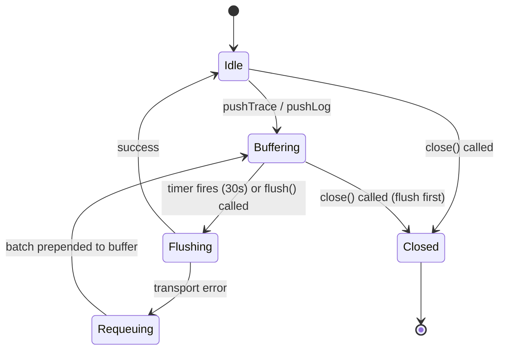

# Telemetry Flow

> End-to-end data flow for traces and logs from instrumented application to the Upblit dashboard.

---

## Full Flow Diagram



---

## Log Flow



---

## SDK Buffer State Machine



---

## Trace Hierarchy

```
Trace (identified by traceId)
├── Root Span (parentSpanId = null)
│   Created by: middleware on HTTP request arrival
│   requestMethod: "controller:METHOD"
│
├── Service Span (parentSpanId = rootSpanId)
│   Created by: sdk.service("name", fn)
│   requestMethod: "service:name"
│
└── External Call Span (parentSpanId = serviceSpanId)
    Created by: sdk.call("name", fn)
    requestMethod: "external:name"
```

---

## API Key → Application → Project → Organization Linkage

When the backend receives a trace batch:
1. Validates `x-api-key` header against `ApiClient` table in PostgreSQL
2. Resolves `applicationId` from the API key record
3. Resolves `projectId` from the application record
4. Stores trace with `applicationId` and `projectId` in MongoDB

This linkage enables the query: `GET /logs/project?id={projectId}` to return all traces across all applications in a project.

---

## Ingest Payload Schemas

### Trace Batch
```json
{
  "timestamp": "2026-05-27T10:00:00.000Z",
  "traces": [
    {
      "timestamp": "2026-05-27T10:00:00.123Z",
      "requestMethod": "controller:POST",
      "requestURL": "/api/users",
      "responseStatus": 201,
      "traceId": "550e8400-e29b-41d4-a716-446655440000",
      "spanId": "6ba7b810-9dad-11d1-80b4-00c04fd430c8",
      "parentSpanId": null,
      "durationMs": 145
    }
  ]
}
```

### Log Batch
```json
{
  "timestamp": "2026-05-27T10:00:00.000Z",
  "logs": [
    {
      "traceId": "550e8400-e29b-41d4-a716-446655440000",
      "level": "error",
      "type": "app",
      "message": "Payment processing failed: timeout",
      "timestamp": "2026-05-27T10:00:00.456Z",
      "clientTimestamp": "2026-05-27T10:00:00.450Z"
    }
  ]
}
```

---

## Known Gaps in Telemetry Flow

| Gap | Impact |
|---|---|
| No ingest endpoint authentication validation documented | Unknown if API key validation is implemented in backend ingest controllers |
| No metrics SDK emitter | Metrics model exists in backend but no SDK sends metrics data |
| No trace sampling | 100% of traces are collected — will cause storage growth at scale |
| No OpenTelemetry (OTLP) support | Cannot integrate with standard observability tools (Jaeger, Tempo, etc.) |
| No real-time streaming | Dashboard requires manual refresh to see new traces |
| `ingest.upblit.com` vs `localhost:8080` | Go SDK targets `ingest.upblit.com`; Python SDK targets `ingest.upblit.dev`; Express SDK targets the backend directly. Inconsistency needs resolution. |
