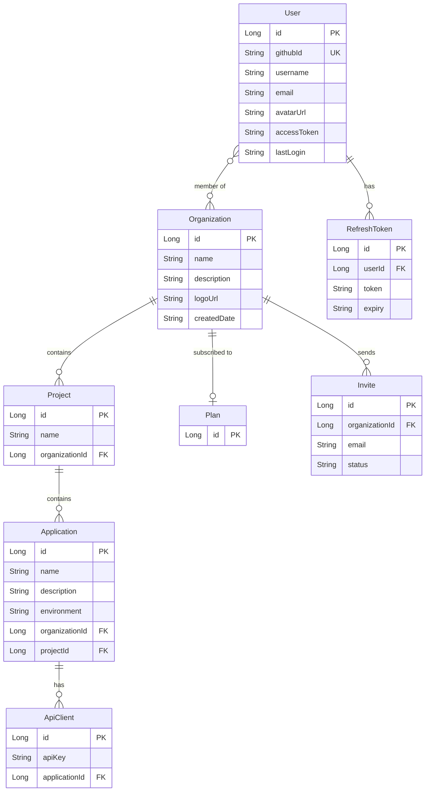

# Database Architecture

> Data storage design, schema ownership, and query patterns.

---

## Storage Systems

| System | Type | Purpose | Connection |
|---|---|---|---|
| PostgreSQL | Relational | Identity, structure, billing | `POSTGRES_URL` |
| MongoDB Atlas | Document | Telemetry, AI content | `MONGODB_URI` |
| Supabase | Object storage | Files (logos, AI docs) | `SUPABASE_URI` |

---

## PostgreSQL Schema

Managed by Spring JPA with `ddl-auto=update`. Schema evolves automatically on startup.



### PostgreSQL Indexes (Recommended)
```sql
-- Performance indexes (not yet confirmed as created)
CREATE INDEX idx_project_org ON project(organization_id);
CREATE INDEX idx_application_project ON application(project_id);
CREATE INDEX idx_application_org ON application(organization_id);
CREATE INDEX idx_api_client_application ON api_client(application_id);
CREATE INDEX idx_refresh_token_user ON refresh_token(user_id);
CREATE UNIQUE INDEX idx_user_github ON "user"(github_id);
```

---

## MongoDB Collections

Managed by Spring Data MongoDB. No schema enforcement — documents are flexible.

### `traces` Collection
```json
{
  "_id": "ObjectId",
  "projectId": "Long",
  "applicationId": "Long",
  "traceId": "String (UUID)",
  "timestamp": "ISODate",
  "telemetry": [
    {
      "timestamp": "ISODate",
      "requestMethod": "String",
      "requestURL": "String",
      "responseStatus": "Number",
      "traceId": "String",
      "spanId": "String (UUID)",
      "parentSpanId": "String | null",
      "durationMs": "Number"
    }
  ]
}
```

**Required Indexes:**
```javascript
db.traces.createIndex({ projectId: 1, timestamp: -1 })
db.traces.createIndex({ applicationId: 1, timestamp: -1 })
db.traces.createIndex({ traceId: 1 })
db.traces.createIndex({ timestamp: 1 }, { expireAfterSeconds: 7776000 }) // 90 days TTL
```

### `logs` Collection
```json
{
  "_id": "ObjectId",
  "projectId": "Long",
  "applicationId": "Long",
  "traceId": "String | null",
  "level": "String",
  "type": "String",
  "message": "String",
  "timestamp": "ISODate",
  "clientTimestamp": "ISODate"
}
```

**Required Indexes:**
```javascript
db.logs.createIndex({ projectId: 1, timestamp: -1 })
db.logs.createIndex({ applicationId: 1, timestamp: -1 })
db.logs.createIndex({ traceId: 1 })
db.logs.createIndex({ level: 1 })
db.logs.createIndex({ timestamp: 1 }, { expireAfterSeconds: 7776000 }) // 90 days TTL
```

### `metrics` Collection
```json
{
  "_id": "ObjectId",
  "projectId": "Long",
  "applicationId": "Long",
  "timestamp": "ISODate"
  // Additional fields TBD — model exists but no SDK emitter
}
```

### `tenants` Collection (AI Gateway)
```json
{
  "_id": "ObjectId",
  "name": "String",
  "organizationId": "Long"
}
```

### `docs` Collection (AI Gateway)
```json
{
  "_id": "ObjectId",
  "tenantId": "ObjectId",
  "fileName": "String",
  "supabaseUrl": "String",
  "uploadedAt": "ISODate"
}
```

---

## Supabase Storage

Used for binary file storage. The backend stores the Supabase CDN URL in the database.

| Bucket | Content | Stored URL In |
|---|---|---|
| `org-logos` | Organization logo images | `Organization.logoUrl` |
| `ai-docs` | AI knowledge-base documents | `Doc.supabaseUrl` (assumed) |

### Supabase Rules
- Files are accessed via Supabase CDN URLs — not proxied through the backend
- File metadata (name, URL, upload time) is stored in MongoDB
- File content is stored in Supabase only

---

## Database Decision Log

| Decision | Rationale |
|---|---|
| PostgreSQL for identity/structure | Relational integrity for user-org-project-app hierarchy; ACID transactions for API key generation |
| MongoDB for telemetry | High write throughput; flexible schema for span data; no joins needed for trace queries |
| Supabase for files | Managed object storage with CDN; avoids local disk dependency in containers |
| `ddl-auto=update` | Acceptable for development; must switch to `validate` + Flyway before production scale |
| Shared schema multi-tenancy | Simplest model for current scale; revisit at 1,000+ organizations |
