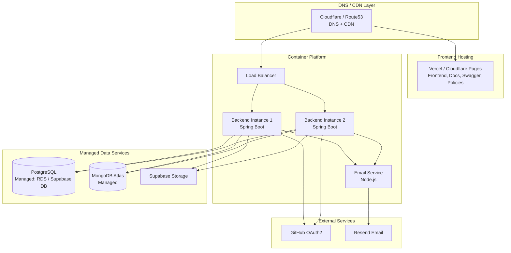

# Deployment Topology

> Current and target deployment architecture. This is a descriptive document — no deployment automation exists yet.

---

## Current State

No automated deployment pipeline exists. Services are deployed manually.

| Service | Deployable? | Method | Notes |
|---|---|---|---|
| Backend | Yes | Docker (Dockerfile exists) | Manual |
| Frontend | Yes | Vercel / Docker | No config found |
| Email Service | Partial | Node.js process | No Dockerfile |
| Docs | Yes | Vercel / static | No config found |
| Swagger UI | Yes | Vercel / static | No config found |
| Policies | Yes | Vercel / static | No config found |
| DeployX CLI | Yes | Go binary | No release pipeline |

---

## Target Deployment Architecture



---

## Environment Configuration

### Backend Environment Variables
```
# Database
MONGODB_URI=mongodb+srv://...
POSTGRES_URL=jdbc:postgresql://...
POSTGRES_USERNAME=...
POSTGRES_PASSWORD=...

# Auth
GITHUB_CLIENT_ID=...
GITHUB_CLIENT_SECRET=...
REDIRECT_URI=https://api.upblit.com/login/oauth2/code/github
JWT_SECRET=<min-256-bit>

# Services
FRONTEND_URI=https://app.upblit.com
EMAIL_URI=http://email-service:3000
EMAIL_SECRET=...

# Storage
SUPABASE_API_KEY=...
SUPABASE_URI=https://<project>.supabase.co
```

### Frontend Environment Variables
```
NEXT_PUBLIC_BACKEND_URI=https://api.upblit.com
NEXT_PUBLIC_API_URL=https://api.upblit.com
```

---

## Port Assignments

| Service | Port | Notes |
|---|---|---|
| Backend API | 8080 | Spring Boot default |
| Frontend | 3000 | Next.js default |
| Email Service | 3000 | Express default — conflicts with frontend in local dev |

**Issue**: Frontend and email service both use port 3000. In local development, they cannot run simultaneously without port remapping. The `docker-compose.yml` (when created) must remap the email service to a different port (e.g., 3001).

---

## Deployment Gaps

| Gap | Impact | Task |
|---|---|---|
| No CI/CD pipeline | Manual deployments only | INFRA-001 through INFRA-005 |
| No `docker-compose.yml` | Cannot run full stack locally | INFRA-006 |
| No email service Dockerfile | Cannot containerize email service | INFRA-007 |
| No health check endpoint in backend | Load balancer cannot verify health | BE-022 |
| No container registry configured | Cannot push/pull images | INFRA-016 |
| Port conflict (frontend + email both on 3000) | Cannot run both locally | INFRA-006 |
| No rollback procedure documented | Cannot recover from bad deploy | INFRA-015 |

---

## Scaling Considerations

The backend is stateless (JWT auth, no in-memory session state) and can be horizontally scaled behind a load balancer. The only shared state is in PostgreSQL and MongoDB.

**Prerequisites for horizontal scaling:**
1. Sticky sessions are NOT required (JWT is stateless)
2. MongoDB connection pooling must be configured
3. PostgreSQL connection pooling (HikariCP is already configured via `spring.datasource.hikari.*`)
4. File uploads must go to Supabase (not local disk) — already the case
