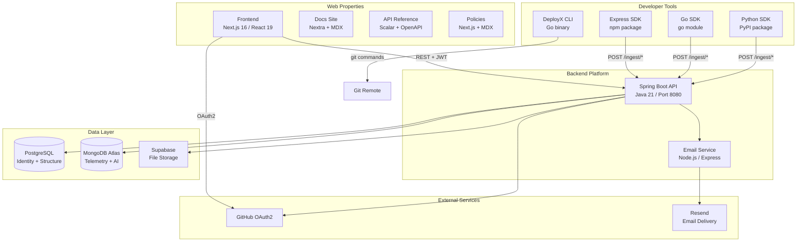
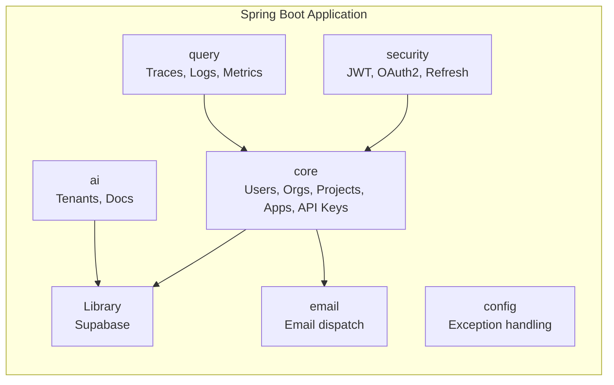
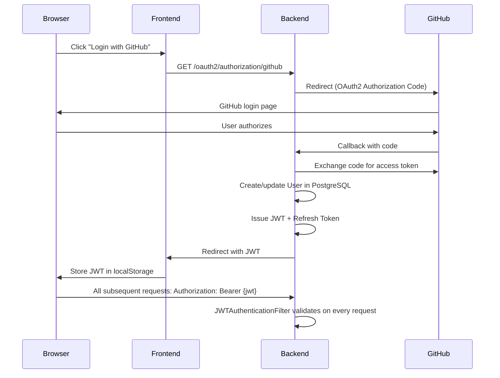

# System Design

> Upblit — AI-Native Cloud Developer Platform
> Status: Descriptive document — no migrations, no infra scripts

---

## Overview

Upblit is a developer platform for deploying, observing, and scaling applications. It provides:
- A deployment CLI (`deployx`) for Git-based deployments
- A web dashboard for managing organizations, projects, and applications
- An observability layer (traces, logs, metrics) via multi-language SDKs
- An AI Gateway for knowledge-base management
- A multi-language SDK ecosystem (Express, Go, Python, Java, React)

Core philosophy: **Deploy. Observe. Scale.**

---

## High-Level Architecture



---

## Request Lifecycle

### Authenticated Dashboard Request
```
Browser → Frontend (Next.js)
       → GET /org (with JWT Bearer token)
       → Backend (JWTAuthenticationFilter validates token)
       → OrganizationService (checks user membership)
       → OrganizationRepository (PostgreSQL query)
       → Response: Organization[]
       → Frontend renders OrgCard grid
```

### SDK Telemetry Ingest
```
Instrumented App → SDK middleware (intercepts HTTP request)
                → Creates traceId + rootSpanId in AsyncLocal context
                → Request proceeds through app code
                → sdk.service() / sdk.call() create child spans
                → Response sent → root span pushed to buffer
                → Every 30s: SDK flushes buffer
                → POST /ingest/traces (x-api-key header)
                → Backend validates API key → resolves applicationId/projectId
                → Stores trace in MongoDB
```

### OAuth2 Login
```
Browser → GET /oauth2/authorization/github
       → Redirect to GitHub OAuth
       → User authorizes → GitHub redirects to REDIRECT_URI
       → Backend: CustomOAuth2UserService creates/updates User in PostgreSQL
       → OAuth2SuccessHandler issues JWT + refresh token
       → Frontend stores JWT in localStorage["token"]
```

---

## Module Architecture (Backend)

The backend uses **Spring Modulith** to enforce module boundaries at compile time.



---

## Data Architecture

### PostgreSQL (Relational — Identity & Structure)
- Users, Organizations, Projects, Applications
- API Keys (ApiClient), Invites, Plans
- Refresh Tokens
- Managed by JPA/Hibernate with `ddl-auto=update`

### MongoDB (Document — Telemetry & AI Content)
- Traces (distributed trace spans)
- Logs (structured log entries)
- Metrics (application metrics — emitter not yet built)
- AI Docs (knowledge-base document metadata)
- AI Tenants

### Supabase (Object Storage — Files)
- Organization logos
- AI Gateway documents

---

## Security Architecture



---

## Current System Gaps

| Category | Gap | Severity |
|---|---|---|
| Security | No explicit RBAC roles | Critical |
| Security | API key storage format unverified | High |
| Observability | No metrics SDK emitter | Medium |
| Observability | No real-time streaming | Medium |
| Infrastructure | No CI/CD pipeline | High |
| Infrastructure | No docker-compose for local dev | High |
| Database | No TTL on telemetry collections | High |
| Database | No explicit migration tool | High |
| SDK | Ingest URL inconsistency | High |
| SDK | Java, React, npm SDKs not implemented | Medium |
| CLI | Several commands referenced but not implemented | Medium |
