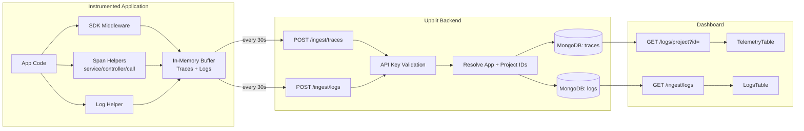

# Telemetry Pipeline

> End-to-end architecture of the observability data pipeline.

---

## Pipeline Overview



---

## Ingest Stage

### Authentication
- Header: `x-api-key: <api-key>`
- Backend validates key against `ApiClient` table in PostgreSQL
- Resolves `applicationId` → `projectId` → `organizationId`

### Payload Validation
- Content-Type must be `application/json`
- Envelope must contain `timestamp` (ISO8601) and `traces[]` or `logs[]`
- Individual trace/log items must have required fields

### Storage
- Traces stored in MongoDB `traces` collection with `applicationId` and `projectId`
- Logs stored in MongoDB `logs` collection with `applicationId` and `projectId`

---

## SDK Buffer Behavior

```
SDK initialized with apiKey
    ↓
Background flush goroutine/thread starts (interval: 30s)
    ↓
HTTP request arrives → middleware creates root span in context
    ↓
App code runs → span helpers create child spans → pushed to trace buffer
    ↓
App code calls sdk.log() → log entry pushed to log buffer
    ↓
Response sent → root span pushed to trace buffer
    ↓
Every 30s: flush() called
    ├── FlushTraces: drain buffer → POST /ingest/traces
    │   ├── Success: buffer cleared
    │   └── Failure: batch re-queued at front of buffer
    └── FlushLogs: drain buffer → POST /ingest/logs
        ├── Success: buffer cleared
        └── Failure: batch re-queued at front of buffer
```

### Special Cases
- `fatal` log level: flush immediately (do not buffer)
- `sdk.close()` / `sdk.Close()`: stop background flusher, flush remaining buffer

---

## Query Stage

### Trace Query
```
GET /logs/project?id={projectId}
    ↓
ProjectAccessService: verify user has access to projectId
    ↓
TraceRepository: findByProjectId(projectId)
    ↓
MongoDB query: { projectId: projectId }
    ↓
Response: Trace[] (each with telemetry: Event[])
```

### Log Query
```
GET /ingest/logs
    ↓
LogRepository: findAll() (currently — needs pagination + filtering)
    ↓
Response: Log[]
```

---

## Data Schemas

### Trace Document (MongoDB)
```json
{
  "_id": "ObjectId",
  "projectId": 42,
  "applicationId": 7,
  "traceId": "550e8400-e29b-41d4-a716-446655440000",
  "timestamp": "2026-05-27T10:00:00.000Z",
  "telemetry": [
    {
      "timestamp": "2026-05-27T10:00:00.123Z",
      "requestMethod": "controller:POST",
      "requestURL": "/api/users",
      "responseStatus": 201,
      "traceId": "550e8400-e29b-41d4-a716-446655440000",
      "spanId": "6ba7b810-9dad-11d1-80b4-00c04fd430c8",
      "parentSpanId": null,
      "durationMs": 145
    }
  ]
}
```

### Log Document (MongoDB)
```json
{
  "_id": "ObjectId",
  "projectId": 42,
  "applicationId": 7,
  "traceId": "550e8400-e29b-41d4-a716-446655440000",
  "level": "error",
  "type": "app",
  "message": "Payment processing failed: timeout",
  "timestamp": "2026-05-27T10:00:00.456Z",
  "clientTimestamp": "2026-05-27T10:00:00.450Z"
}
```

---

## Pipeline Gaps

| Gap | Impact | Task |
|---|---|---|
| No MongoDB indexes on `projectId`, `applicationId`, `traceId` | Slow queries at scale | SCALE-001 through SCALE-003 |
| No TTL on telemetry collections | Unbounded storage growth | SCALE-004, SCALE-005 |
| No pagination on query endpoints | Large responses for active projects | OBS-009, OBS-010 |
| No rate limiting on ingest | Storage abuse possible | OBS-003 |
| No metrics SDK emitter | Metrics model exists but no data flows | OBS-016 through OBS-020 |
| Ingest URL inconsistency across SDKs | SDKs may send to wrong endpoint | SDK-001 |
| No real-time streaming | Dashboard requires manual refresh | OBS-022 through OBS-024 |
